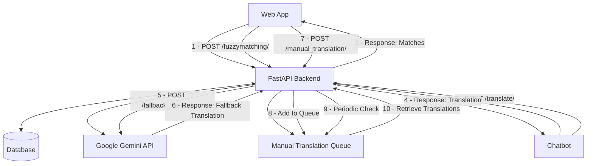

```mermaid
graph TB
    A[Web App]
    B[Chatbot]
    C[FastAPI Backend]
    D[(Database)]
    E[Google Gemini API]
    F[Manual Translation Queue]

    A --> C
    B --> C
    C <--> D
    C --> E
    C --> F

    A -->|1 - POST /fuzzymatching/| C
    C -->|2 - Response: Matches| A

    B -->|3 - POST /translate/| C
    C -->|4 - Response: Translation| B

    C -->|5 - POST /fallback_translation/| E
    E -->|6 - Response: Fallback Translation| C

    A -->|7 - POST /manual_translation/| C
    C -->|8 - Add to Queue| F

    C -->|9 - Periodic Check| F
    F -->|10 - Retrieve Translations| C
```