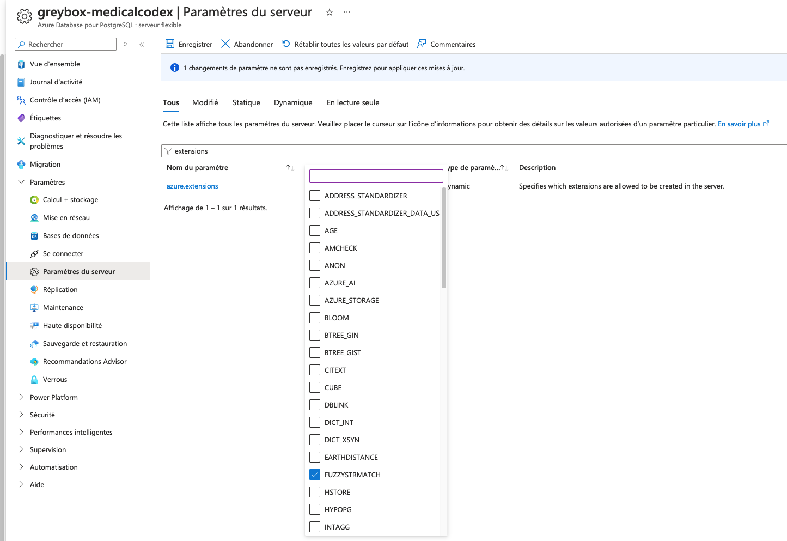

# Installation steps for Azure (MacOS based)

## Install Azure CLI on macOS

Source: <https://learn.microsoft.com/en-us/cli/azure/install-azure-cli-macos>

Install the Azure CLI if you don't already have it installed

```shell
brew update && brew install azure-cli
```

## Login to Azure

```shell
az login --use-device-code
export AZ_SUBSCRIPTION_ID=""
az account set --subscription "${AZ_SUBSCRIPTION_ID}"
```

## Create an App Service Plan

Set the Service Plan variables

```shell
export AZ_APPSERVICE_PLAN="MedicalCodexApp"
export AZ_RESGRP="project_codex_dev"
export AZ_APP_NAME="MedicalCodexBackend"
```

If you don't have already an App Service Plan, create one

```shell
az appservice plan create \
--name "${AZ_APPSERVICE_PLAN}" \
--resource-group "${AZ_RESGRP}" \
--sku B1 \
--is-linux \
--tags project=codex
```

## Create a web app

```shell
az webapp create --name "${AZ_APP_NAME}" \
--resource-group "${AZ_RESGRP}" \
--plan "${AZ_APPSERVICE_PLAN}" \
--runtime "PYTHON|3.11"
```

## Configure starting command

```shell
az webapp config set --resource-group "${AZ_RESGRP}" --name "${AZ_APP_NAME}" --startup-file "startup.sh"
```

## Configure Environment Variables

```shell
az webapp config appsettings set --name "${AZ_APP_NAME}" --resource-group "${AZ_RESGRP}" --settings LOGGING_FORMAT='%(levelname) -10s %(asctime)s %(name) -30s %(funcName) -35s %(lineno) -5d: %(message)s'
az webapp config appsettings set --name "${AZ_APP_NAME}" --resource-group "${AZ_RESGRP}" --settings LOGGING_LEVEL='NOTSET'
az webapp config appsettings set --name "${AZ_APP_NAME}" --resource-group "${AZ_RESGRP}" --settings SCM_DO_BUILD_DURING_DEPLOYMENT=1
# Fill values from .env here
az webapp config appsettings set --name "${AZ_APP_NAME}" --resource-group "${AZ_RESGRP}" --settings DB_TYPE=''
az webapp config appsettings set --name "${AZ_APP_NAME}" --resource-group "${AZ_RESGRP}" --settings DB_HOST=''
az webapp config appsettings set --name "${AZ_APP_NAME}" --resource-group "${AZ_RESGRP}" --settings DB_PORT=''
az webapp config appsettings set --name "${AZ_APP_NAME}" --resource-group "${AZ_RESGRP}" --settings DB_NAME=''
az webapp config appsettings set --name "${AZ_APP_NAME}" --resource-group "${AZ_RESGRP}" --settings DB_USER=''
az webapp config appsettings set --name "${AZ_APP_NAME}" --resource-group "${AZ_RESGRP}" --settings DB_PASSWORD=''
```

## Deploy Web App

```
az webapp up --name "${AZ_APP_NAME}" \
--resource-group "${AZ_RESGRP}" \
--sku B1 --runtime "PYTHON|3.11"
```

## Enable PostgreSQL database extension

To enable this extension in Azure, you need first to allow it from the Azure Portal: Server parameters / extensions.

See [Manage PostgreSQL extensions in Azure Database for PostgreSQL - Flexible Server](https://learn.microsoft.com/en-us/azure/postgresql/extensions/how-to-allow-extensions?tabs=allow-extensions-portal%2Cload-libraries-portal#how-to-use-postgresql-extensions)
for more details.



```
CREATE EXTENSION fuzzystrmatch;
```